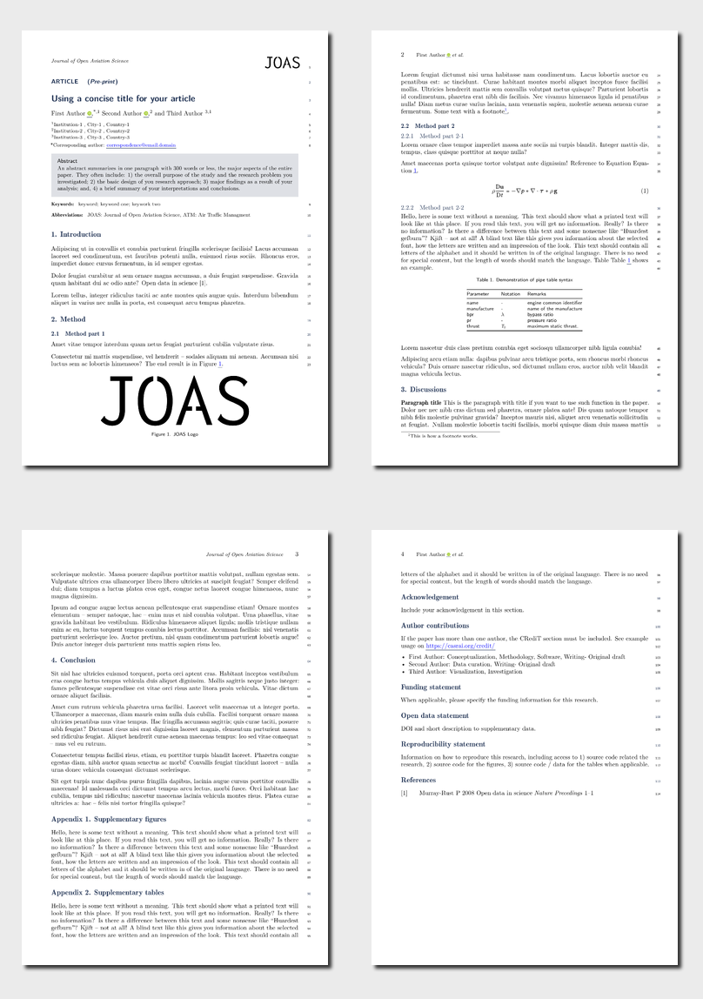

<!-- README.md is generated from README.qmd. Please edit that file -->

# JOAS

This Quarto format will help you create articles for the Journal of Open
Aviation Science (JOAS).

## Creating a new article

You can use this as a template to create an article. To do this, use the
following command:

``` bash
# eventually to be moved to quarto-journals
quarto use template espinielli/quarto-joas
```

This will install the extension and create an example qmd file that you
can use as a starting place for your article.

**NOTE**: please soon after the creation of your article remember to
render the qmd twice for the first time. This will copy the needed
files.

## Installation for existing document

You may also use this format with an existing Quarto project or
document. From the quarto project or document directory, run the
following command to install this format:

``` bash
# eventually to be moved to quarto-journals
quarto install extension espinielli/quarto-joas
```

## Example

[](examples/template.pdf)

# Options

## Document class

- `manuscript=`
  - `manuscript=article` (default)
  - `manuscript=rescience`
  - `manuscript=data`
  - `manuscript=software`
  - `manuscript=proceedings`
  - `manuscript=poster`
- `layout=`
  - `preprint` for submission
  - `publish` for publisher only
- `volume=` used by publisher
- `year=` used by publisher

``` yml
format:
  joas-pdf:
    classoption:
      - "manuscript=article"
      - "layout=preprint"
      - "volume=1"
      - "year=2023"
```

## Publisher options

- `joas-doi`: the DOI of the paper
- `joas-editor`: the name of the editor
- `joas-reviewer`: the list of reviewers
- `joas-dates`: the review dates

``` yml
joas-doi: "10.74800/joas.x.xxxx"
joas-editor: Editor Name
joas-reviewer:
  - First Reviewer
  - Second Reviewer
  - Third Reviewer
joas-dates:
  received: "1 April 2022"
  revised: "1 May 2022"
  accepted: "10 May 2022"
  published: "20 May 2022"
```

## Other options

``` yml
joas-abbreviations:
  - "JOAS: Journal of Open Aviation Science"
  - "ATM: Air Traffic Managment"
```
